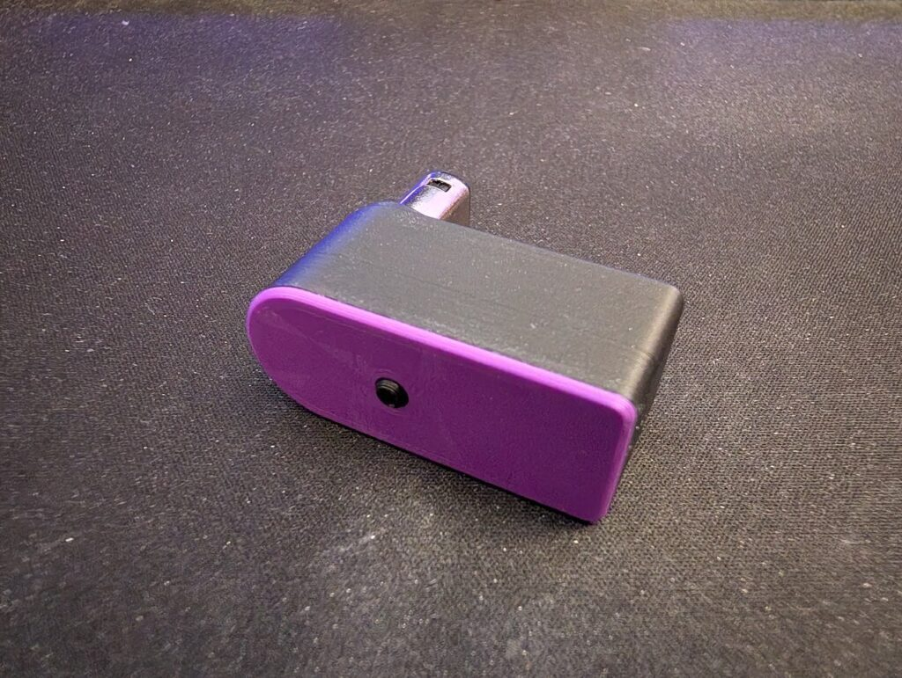
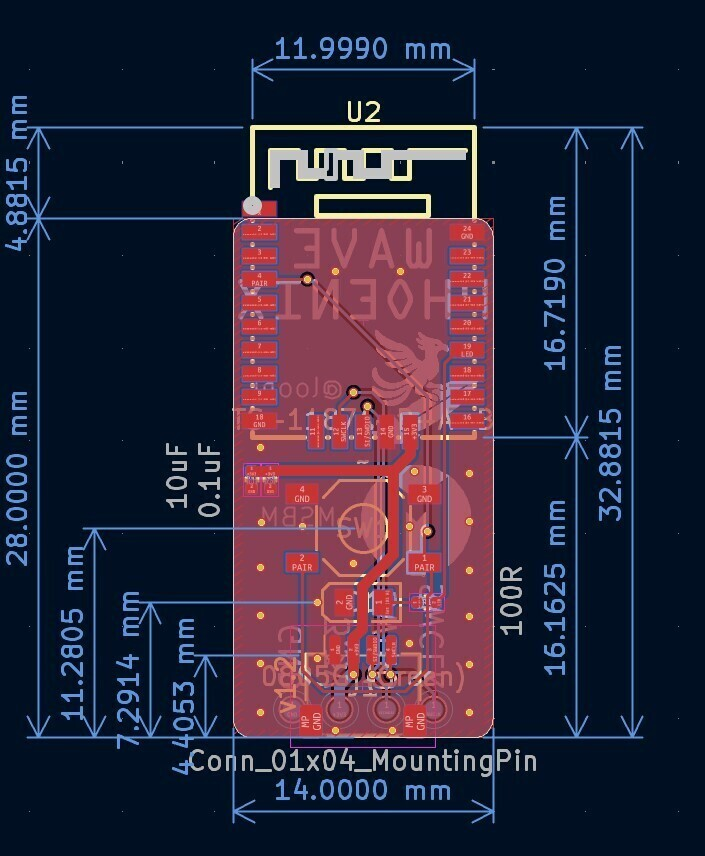

<h1 align="center">
    WavePhoenix-MSBM-Altboard
</h1>

    An alternate board design for the WavePhoenix Nintendo WaveBird open-source receiver 

    

## Motivation

loopj's Wavephoenix receiver design relies on the RF-Star RF-BM-BG22C3 SoC, which quickly became out-of-stock everywhere, potentially due to people wanting them to make Wavephoenix receivers. So, I set out looking for an alternative. I ended up stumbling upon the [RF-BM-BG22A3](https://www.rfstariot.com/rf-bm-bg22a3-ble5-3-efr32bg22-module_p81.html) which utillizes the same SoC, in a slightly larger package. This means that, if wired properly, it could use the same firmware as the stock Wavephoenix board without modifications. All that was needed was an updated PCB design to utillize this alternate package, and a reworked case to fit the new PCB. The result is slightly bigger than the stock Wavephoenix, but still quite a bit smaller than the original Wavebird receiver.

As a bonus, the pcb antenna in the RF-BM-BG22A3 has great range. I have clocked over 40 feet of range without noticing dropouts.

## Firmware

The WavePhoenix-MSBM-Altboard is identical to the stock firmware of the WavePhoenix, [which can be found here](https://github.com/loopj/wavephoenix).

## Hardware

The hardware for the WavePhoenix-MSBM-Altboard receiver variant is available in the [`hardware/mini-receiver-msbm-altboard`](hardware/mini-receiver-msbm-altboard) directory. The receiver is similar to the reference WavePhoenix receiver other than the replacement of the RF-BM-BG22C3 with the RF-BM-BG22A3.

 

The hardware folder contains a simple PCB which hosts a [RF-BM-BG22A3](https://www.rfstariot.com/rf-bm-bg22a3-ble5-3-efr32bg22-module_p81.html) module, a pairing button, a status LED, and a JST connector for connecting to a GameCube controller port, as well as a 3D printable case.

- [`case`](hardware/mini-receiver-msbm-altboard/case) - 3D printable case for the receiver
- [`case-usb`](hardware/mini-receiver-msbm-altboard/case-usb) - 3D printable case for a special USB variant of the receiver
- [`gerbers`](hardware/mini-receiver-msbm-altboard/gerbers) - Gerber files for ordering the PCB
- [`KiCad`](hardware/mini-receiver-msbm-altboard/KiCad) - KiCad project files for the PCB

Check out the [`hardware/mini-receiver-msbm-altboard/README.md`](hardware/mini-receiver-msbm-altboard/README.md) for more information on how to build your own receiver based on this hardware variant.

## Special Thanks

- [loopj](https://www.tindie.com/products/rfstariot/efr32bg22-long-range-bluetooth-wireless-module/) - for creating the original WavePhoenix firmware and hardware that this variant is based on
- [dwillmore](https://github.com/dwillmore) and [unicab369](https://github.com/unicab369) - for giving me a crash course in using KiCad

## License

The firmware in this repository is licensed under the [MIT License](firmware/LICENSE).

The hardware is licensed under the [Solderpad Hardware License v2.1](hardware/LICENSE).
