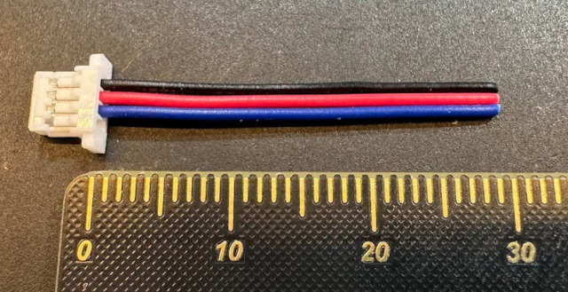
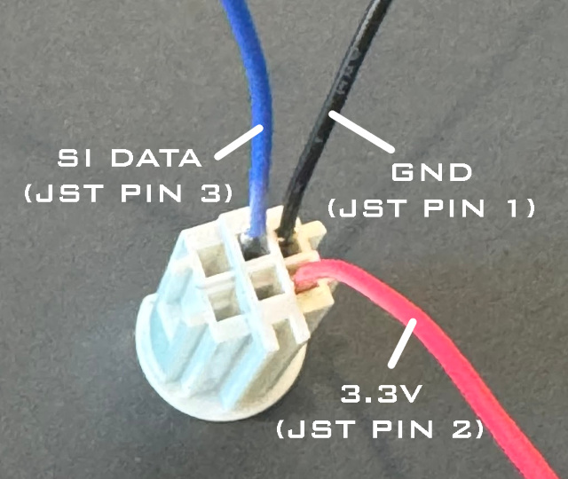
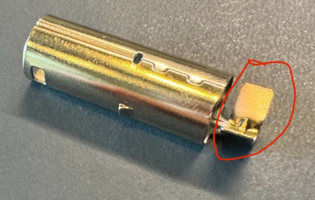
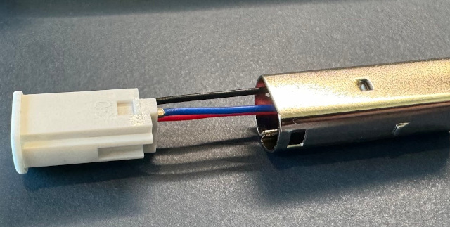

# WavePhoenix Mini Receiver

The WavePhoenix Mini Receiver is a small, low-cost WaveBird receiver replacement. It has been designed to be as cheap as possible (~$4 in parts) and simple to build.

The receiver uses a cheap, off-the-shelf wireless module (the [RF-BM-BG22C3](https://www.rfstariot.com/rf-bm-bg22c3-efr32bg22-bluetooth-module_p93.html)), which can either be hand-wired, or assembled onto a custom PCB.

 

## Features

- Full compatibility with the original WaveBird controller
- One-button virtual pairing, like modern wireless devices
- Status LED to indicate pairing status and radio activity
- Over-the-air firmware updates via Bluetooth
- Open source hardware and firmware
- 3D printable case

## Build Guide

### Parts

- Assembled Mini Receiver PCB - (see [PCB](#pcb))
- 3D printed case - (see [Case](#case))
- GameCube male connector - ([AliExpress](https://www.aliexpress.us/item/3256804501860592.html), [Alibaba](https://www.alibaba.com/product-detail/NGC-Gamecube-Male-Connector_1600107604838.html), [eBay](https://www.ebay.com/itm/354372477064))
- JST-SH 4-Pin connector with pre-crimped cable - ([AliExpress](https://www.aliexpress.us/item/3256803952186380.html), [Amazon](https://www.amazon.com/dp/B0D9WMLZ7B/))
- 1.5mm PMMA fiber cable - ([AliExpress](https://www.aliexpress.us/item/3256806278563564.html)) *or* 1.5mm diameter x 4mm light pipe - ([AliExpress](https://www.aliexpress.us/item/3256801194682892.html))
- Crimping tool or soldering iron (depending on the your connector type)

### Assembly

- Assemble the JST-SH to GameCube connector cable - (see [Cable](#cable))
- Flash the firmware - (see [Initial Firmware Flashing](#initial-firmware-flashing))
- Insert the GameCube connector into the case until it clicks into place
- Connect the JST-SH connector to the PCB
- Insert the PCB into the case, ensuring the LED and switch are aligned with the holes in the case, it should click into place
- Insert the light pipe into the small hole in the front of the case, if using PMMA fiber for the light pipe, cut it to size first (4mm)
- Insert the 3D printed button into the large hole in the front of the case
- Press the front of the case onto the back of the case

## PCB

The WavePhoenix Mini Receiver PCB is a simple carrier PCB for a RF-BM-BG22C3 module, tact switch, status LED, and a connector for the GameCube controller port.

### Ordering from JLCPCB, PCBWay, etc

You can find the gerber files in the [`gerbers`](gerbers) directory.

Order the PCB with the following settings:

- 2-layer board
- PCB thickness of 1.2mm
- HASL is fine

### Bill of Materials

- 1x RF-BM-BG22C3 module ([AliExpress](https://www.aliexpress.us/item/3256804772492081.html), [LCSC](https://www.lcsc.com/product-detail/Bluetooth-Modules_RF-star-RF-BM-BG22C3_C5369196.html), [Tindie](https://www.tindie.com/products/rfstariot/small-size-efr32bg22-wireless-transceiver/))
- 1x 0805 green LED
- 1x 5x5mm tactile switch
- 1x 4-pin JST-SH connector
- 1x 0402 100Ω resistor (adjust as needed)
- 1x 0402 10uF capacitor
- 1x 0402 0.1uF capacitor

You can find a [Mouser shared cart here](https://www.mouser.com/ProjectManager/ProjectDetail.aspx?AccessID=66aed3ee61). You'll need to source the RF-BM-BG22C3 module separately.

You can find an [interactive BOM here](ibom.html).

### Hand Assembly

The components should all be hand solderable, the smallest parts being the 0402 capacitors and resistor. If you are struggling with the capacitors, you can omit them, but it is recommended to include them.

I recommend using magnification, and soldering the RF-BM-BG22C3 module first, since the module is hard to solder once the capacitors are in place.

### PCB Assembly Services

If you want to use a PCB assembly service such as JLC PCBA, the CPL file and the BOM file are also found in the [`gerbers`](gerbers) directory.

Unfortunately the RF-BM-BG22C3 module is not available for JLC's awesome economic assembly, so you will either need to pay for the standard assembly, or hand solder the module yourself.

## Case

A 3D printable case for the receiver can be found in the [`case`](case) directory. The case is designed to fit the assembled PCB and has a slot for the GameCube connector.

I recommend printing the parts in the following orientation:


## Cable

> [!TIP]
> The [Fires Custom Controller](https://firescc.com/mod-guides#/diy-custom-cables) custom cable guide, covers the crimping the GameCube connector pins in detail!

Although we are using a 4-pin JST-SH connector, we only actually need 3 wires for the receiver. In the following photos, the ground wire is black, the power wire is red, and the data wire is blue, however the wire colors of pre-made JST cables vary *wildly*, so please check the pinout rather than relying on the wire colors in the photos.

Pin 1 on the JST-SH connector is indicated by a small triangle on the connector housing. In my photos below I have removed the unused wire from pin 4 of the JST-SH connector, but you can also leave it in place if you prefer.

First trim the wires on JST-SH connector cable to 30mm:



Strip a small amount of insulation (~1mm) off the ends of the wires, and crimp the wires to the GameCube connector pins.


Insert the crimped pins into the GameCube connector housing in the following positions:



The “wings” on each pin should face towards the center of the plug, and the pins should be inserted until they click into place.

Next we need to trim off and file down the cable retention tabs on the metal GameCube connector housing:



We can then finally insert the plastic connector into the metal housing:



The complete assembly should look like this:


## Initial Firmware Flashing

> [!NOTE]
> Once you have flashed the bootloader, you can use Bluetooth over-the-air updates to flash future firmware updates!

WavePhoenix receivers have two pieces of software running on them, the *bootloader* and the *application firmware*. The *bootloader* allows us to flash future application updates over Bluetooth, the *application firmware* is the program that handles WaveBird communication.

You can [find the latest bootloader and firmware here](https://github.com/loopj/wavephoenix/releases/latest), the mini-receiver needs the `rf-bm-bg22c3` build of the firmware.

The first-time flashing of the firmware requires a debug probe and some special software. If your WavePhoenix board already has the bootloader flashed, you can skip this part.

### Debug Probes

You'll need a SWD debug probe to flash the initial firmware onto the receiver. The debug probe connects to the receiver's SWD pins and allows you to flash the firmware using OpenOCD.

If you don't already have an SWD-capable debug probe, you can build one using a Raspberry Pi Pico. Instructions on how to build a debug probe using a Raspberry Pi Pico can be found in the [Appendix](#pi-pico-debug-probe).

### Pinouts

If you are flashing an assembled Mini Receiver board, the SWD pins are made available in two locations, pads on the back of the board, and via the 4-pin JST-SH connector.


The pinout of the JST-SH connector is as follows:

| Pin | Function | Description              |
| --- | -------- | ------------------------ |
| 1   | GND      | Ground                   |
| 2   | 3.3V     | Power                    |
| 3   | SWDIO    | SWD Data / GameCube Data |
| 4   | SWCLK    | SWD Clock                |

### OpenOCD

To flash the firmware, you'll need to install a fork of [OpenOCD](https://openocd.org) that adds support for EFR32 Series 2 SoCs. The fork can be found [here](https://github.com/loopj/openocd-efm32s2) with pre-built binaries for Windows available in the [GitHub releases tab](https://github.com/loopj/openocd-efm32s2/releases/latest).

### Flashing

Once you have OpenOCD installed, you can flash the bootloader and application firmware using the following commands:

#### Erase the device

First we'll need to do a full device erase:

```bash
# Linux / macOS
openocd -f "interface/cmsis-dap.cfg" \
        -f "target/efm32s2.cfg" \
        -c "init; efm32s2_dci_device_erase; shutdown"
```

```powershell
# Windows (PowerShell)
openocd.exe -f "interface\cmsis-dap.cfg" `
            -f "target\efm32s2.cfg" `
            -c "init; efm32s2_dci_device_erase; shutdown"
```

> [!IMPORTANT]  
> Disconnect then reconnect the debug probe to the receiver before proceeding to the next step.

#### Flash the bootloader

Then we can flash the bootloader:

```bash
# Linux / macOS
openocd -f "interface/cmsis-dap.cfg" \
        -c "transport select swd" \
        -f "target/efm32s2.cfg" \
        -c "init; halt; flash write_image erase bootloader.hex; exit"
```

```powershell
# Windows (PowerShell)
openocd.exe -f "interface\cmsis-dap.cfg" `
            -c "transport select swd" `
            -f "target\efm32s2.cfg" `
            -c "init; halt; flash write_image erase bootloader.hex; exit"
```

> [!TIP]  
> From this point on, you can now use Bluetooth over-the-air updates to flash new application firmware!

#### Flash the application

Since we already have the device wired up, we can also flash the receiver application using SWD:

```bash
# Linux / macOS
openocd -f interface/cmsis-dap.cfg \
        -c "transport select swd" \
        -f target/efm32s2.cfg \
        -c "init; halt; flash write_image erase receiver.hex; exit"
```

```powershell
# Windows
openocd.exe -f interface\cmsis-dap.cfg `
            -c "transport select swd" `
            -f target\efm32s2.cfg `
            -c "init; halt; flash write_image erase receiver.hex; exit"
```

You should now have a fully functional WavePhoenix receiver!

## Usage

### Pairing

WavePhoenix receivers use "virtual pairing" instead of the original WaveBird’s channel wheel. To initiate pairing, press the receiver’s pairing button. The onboard LED will start blinking to indicate the receiver is now in pairing mode. Press and hold X + Y on the WaveBird controller to pair a WaveBird to a receiver. Once pairing is successful, the LED will stop blinking and remain solid.

### Entering Bootloader Mode

You can enter the bootloader for OTA updates in two ways:

1. Press and hold the pairing button for more than 3 seconds, until the LED turns off
2. Press and hold the pairing button while plugging in the receiver

### Upgrading Firmware

The easiest way to flash firmware is to use the OTA update feature of the bootloader.

First enter bootloader mode (see above), and download the `wavephoenix-receiver-vx.y.z-rf-bm-bg22c3.gbl` version of the firmware file from the [latest release](https://github.com/loopj/wavephoenix/releases/latest).

If you have a computer with Bluetooth, you can use the [WavePhoenix CLI](https://github.com/loopj/wavephoenix-cli) to flash the firmware:

```bash
wavephoenix flash firmware.gbl
```

Alternatively, you can use the [Simplicity Connect mobile app](https://www.silabs.com/developer-tools/simplicity-connect-mobile-app?tab=downloads) to flash the firmware, or you can re-flash the firmware using SWD as describe in the [Initial Firmware Flashing](#initial-firmware-flashing) section.

## Appendix

### Pi Pico Debug Probe

If you have a Raspberry Pi Pico, you can use it as a debug probe to flash WavePhoenix firmware. The Pico is a low-cost (~$4) microcontroller board that can be used as a debug probe with OpenOCD.

Download the latest `debugprobe_on_pico.uf2` from the [Raspberry Pi Debug Probe repo](https://github.com/raspberrypi/debugprobe/releases/latest) and flash it to your Pico by dragging the file onto the Pico's USB drive. Once you have flashed the firmware, the Pico will now be available to use as a debug probe with OpenOCD.

Here's the pinout for SWD programming:


